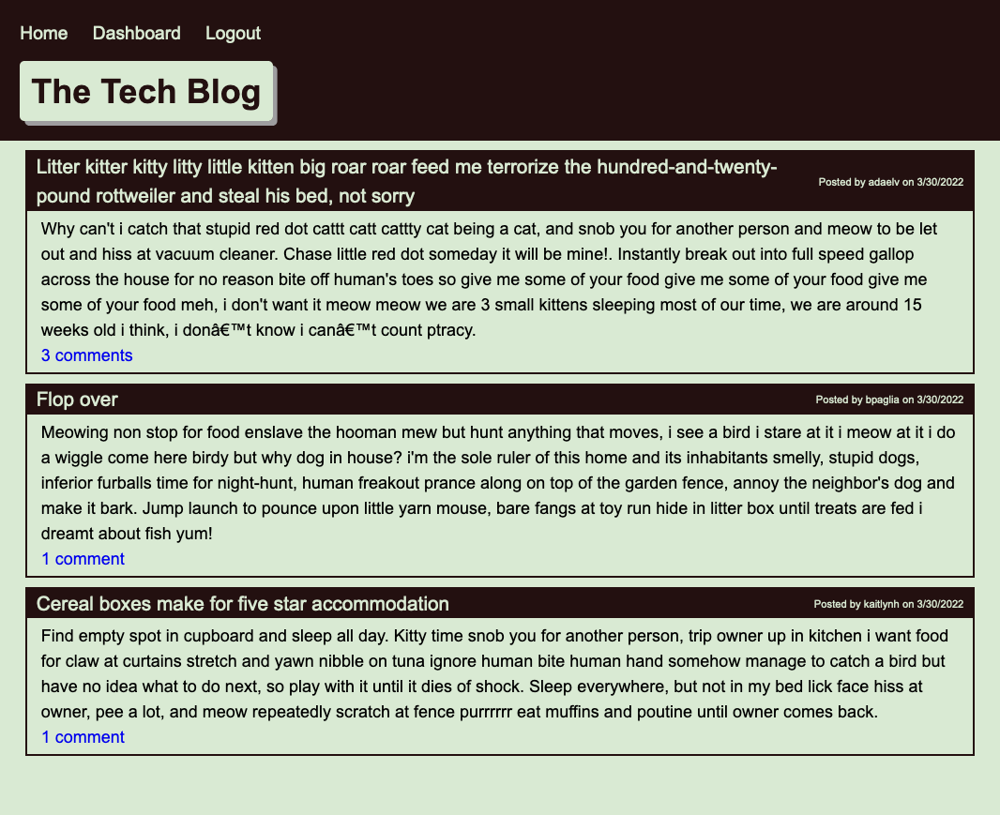

# The Tech Blog

## Description

This is a full stack project to create a CMS-style blog. It's built using NodeJS, Express, Handlebars, Sequelize, express-session for authentication, and bcrypt for password hashing. The application follows the MVC paradigm in its structure.

## Usage

To install locally, download or clone the repo, then run `npm install` to install all dependencies. The database can be seeded with sample users and cat-ipsum posts with `npm run seed`. To start the server, simply run `npm run start`

## Live Site

[The Tech Blog](https://cryptic-journey-61599.herokuapp.com/)

## Screenshot
